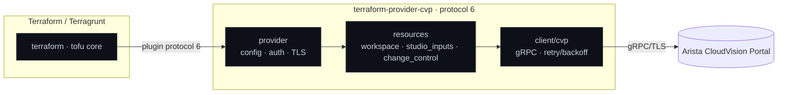

# terraform-provider-cvp

<!-- Build & supply chain -->
[](https://github.com/ioplane/terraform-provider-cvp/actions/workflows/ci.yml)
[](https://github.com/ioplane/terraform-provider-cvp/actions/workflows/security.yml)
[](https://securityscorecards.dev/viewer/?uri=github.com/ioplane/terraform-provider-cvp)
<br>
<!-- Stack & conventions -->
[](https://go.dev/doc/go1.26)
[](https://developer.hashicorp.com/terraform/plugin/framework)
[](https://www.conventionalcommits.org/en/v1.0.0/)
[](https://semver.org/spec/v2.0.0.html)
[](LICENSE)
[](CONTRIBUTING.md)

Terraform provider for **Arista CloudVision Portal (CVP)** — manage workspaces,
Studio inputs, and change control declaratively over gRPC/TLS. Built on the
[Terraform Plugin Framework](https://developer.hashicorp.com/terraform/plugin/framework)
(protocol 6).

> [!NOTE]
> **Status: v0.1 skeleton.** Provider schema is authored; CRUD hooks are stubbed
> (`TODO(P1)`), so this is not yet usable for a real `terraform apply`. See
> [`design.md`](design.md) for the design and roadmap, and [`AGENTS.md`](AGENTS.md)
> for how to work here.

## Architecture at a glance



## Resources in v0.1

| Resource | Backing CVP service | State |
|---|---|---|
| `cvp_workspace` | `arista.workspace.v1.WorkspaceConfigService` | schema only |
| `cvp_studio_inputs` | `arista.studio.v1.InputsConfigService` | schema + JSON validation |
| `cvp_change_control` | `arista.changecontrol.v1.*` | schema only |

## Roadmap (abridged)

- **v0.2** — full CRUD + import for the three resources; `cvp_configlet` +
  `cvp_configlet_assignment`; retry/backoff; acceptance tests against the lab.
- **v0.3** — `cvp_tag_assignment`; AAA (`cvp_service_account*`, `cvp_api_token`);
  auth providers; timeouts/retry knobs; full acceptance suite.
- **v1.0** — 3-tier resource coverage, multi-cluster support, SemVer commitment,
  signed releases + SBOM, Terraform Registry listing.

Full plan and design decisions: [`design.md`](design.md).

## Auth methods

Three, configured natively on the provider (`design.md` D4):

- `cert` — client mTLS (user / package / aerisadmin certificate).
- `session` — session cookie from `/cvpservice/login/authenticate.do`.
- `bearer` — long-lived, rotatable API token (**recommended for CI/CD**).

## Quick start (development)

No host toolchain required — everything runs in the Podman dev container.

```bash
task up        # build + start dev container (golang:1.26-trixie)
task shell     # shell inside it
task build     # build the provider binary
task test      # unit tests (+race)
task all       # build + test + lint + tffmt-check + lint-docs + vulncheck
```

See [`docs/development.md`](docs/development.md) for the full loop, and
[`docs/standards/terragrunt-integration.md`](docs/standards/terragrunt-integration.md)
for driving the provider with Terragrunt.

## Layout

```text
terraform-provider-cvp/
├── main.go                        # provider server bootstrap
├── internal/
│   ├── provider/                  # provider Metadata/Schema/Configure + auth
│   ├── resources/{workspace,studio_inputs,change_control}/
│   ├── client/cvp/                # hand-written gRPC client wrapper (P1)
│   └── pb/                        # buf-generated CVP stubs (ADR 0005, P1)
├── api/proto/                     # vendored cloudvision-apis protos (ADR 0005)
├── buf.yaml · buf.gen.yaml        # proto lint + codegen config
├── examples/                      # HCL + Terragrunt examples (registry docs source)
├── deployments/
│   ├── containers/                # Containerfile.dev + containers/registries.conf
│   └── compose/                   # compose.dev.yml + compose.lint.yml
├── scripts/automation/            # podman-py automation
├── docs/
│   ├── standards/                 # naming, versioning, commits, changelog, Go, provider, Terragrunt
│   ├── adr/                       # Architecture Decision Records
│   ├── methodology.md · development.md · testing.md · release.md · architecture.md
├── .github/workflows/             # ci · release · security · scorecard
├── AGENTS.md · CODEX.md · CLAUDE.md
├── CONTRIBUTING.md · SECURITY.md · CHANGELOG.md · VERSION · LICENSE
├── .golangci.yml · .goreleaser.yml · Taskfile.yml · go.mod
└── design.md · README.md
```

## Standards

This repo follows the house standard (see the sibling `pulumi-eos`):
[SemVer 2.0.0](https://semver.org/spec/v2.0.0.html) ·
[Conventional Commits 1.0.0](https://www.conventionalcommits.org/en/v1.0.0/) ·
[Keep a Changelog 1.1.0](https://keepachangelog.com/en/1.1.0/). Details under
[`docs/standards/`](docs/standards/); process in
[`docs/methodology.md`](docs/methodology.md); contributor guide in
[`CONTRIBUTING.md`](CONTRIBUTING.md).

## Documentation

| Area | Document |
|---|---|
| How to work here (agents + humans) | [`AGENTS.md`](AGENTS.md) |
| Contributing & quality gates | [`CONTRIBUTING.md`](CONTRIBUTING.md) |
| Governance & branch protection | [`GOVERNANCE.md`](GOVERNANCE.md) |
| Security policy | [`SECURITY.md`](SECURITY.md) |
| Design & decisions (D1–D8) | [`design.md`](design.md) |
| Standards | [`docs/standards/`](docs/standards/) |
| Methodology | [`docs/methodology.md`](docs/methodology.md) |
| Architecture · development · testing · release | [`docs/`](docs/) |
| Decision records | [`docs/adr/`](docs/adr/) |

## Contributing

Development is **worktree + Pull Request only** — `main` is never committed to
directly. See [`CONTRIBUTING.md`](CONTRIBUTING.md) and `scripts/worktree.sh`.

## License

[Apache-2.0](LICENSE) (see [ADR 0002](docs/adr/0002-license-apache-2.0.md)).
