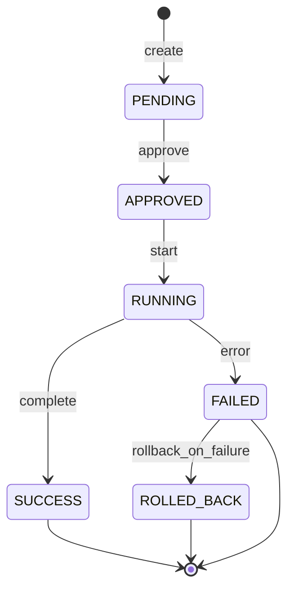

<div align="center">

# terraform-provider-cvp — design

</div>

**Date**: 2026-07-16
**Scope**: I5 phase from `docs/plans/2026-07-16-cvp-integration-plan.md`.
**Baseline**: the existing `terraform-provider-cvaas` (Arista official) plus the
deprecated community `arista-cloudvision` provider.

## Non-goals

- **Do not replace the CVaaS provider.** That one is SaaS-first, with
  CVaaS-specific resource shapes.
- **Do not automate approval.** CVP workflow steps map 1:1 into HCL with
  `auto_approve = false` by default. Human approval happens via the UI or a
  dedicated CI approval step.
- **Do not support CVaaS resources without an on-prem equivalent** (asset-manager
  tenant assignment, etc.). Feature flag: `provider "cvp" { cvaas = true|false }`
  — `false` by default.

## Key design decisions

### D1 — Path-overlap detection at plan time

**Rule**: two `cvp_studio_inputs` cannot share a prefix. Overlap is a
destructive, order-dependent Set.

**Implementation** (v0.2):

```go
type ConfigValidator struct{}

func (v ConfigValidator) ValidateResource(ctx, req, resp) {
    // Aggregate all cvp_studio_inputs.path values across the config.
    // Sort lexicographically.
    // For each adjacent pair, error if one is a prefix of the other.
}
```

Requires the `provider.ConfigValidator` interface, which the framework supports.

### D2 — Workspace = one apply

`cvp_workspace` is the root of the dependency chain. All Studio inputs, tags, and
change-control resources depend on it (via a `workspace_id` reference).

**Not supported**: multiple workspaces in one apply. One Terragrunt unit = one
workspace.

Rationale: the workspace conflict semantic (I2 finding — path-conflict
resolution to last-approved wins) interacts badly with parallel resources.

### D3 — Change-control status as a computed attribute

`cvp_change_control.status` is computed only:



If `wait_for_execution = true`, the provider blocks until a terminal state
(`SUCCESS` / `ROLLED_BACK` / `FAILED`). Timeout: the `changecontrol_timeout`
provider argument, default 30m.

### D4 — Three auth methods, native provider config

`auth_method = "session" | "cert" | "bearer"`.

- **session**: token pre-obtained (a CI/CD login step), passed via `token`.
- **cert**: `cert_pem`, `key_pem`, optional `ca_pem`.
- **bearer**: `token` — a long-lived API token.

Rejected alternatives:

- Provider-side session login (username+password). **Rejected** — the password
  lands in state; a credentials risk.
- Environment-only config. **Rejected** — poor UX with Terragrunt.

### D5 — Immutable studios (from_package)

`cvp_studio.from_package` is computed. If it is non-empty after import, the
provider marks the resource read-only and errors on Update. Rationale — CVP
rejects the modification anyway; failing early with a clear error is better than
a gRPC error at apply time.

### D6 — Secrets

`is_secret: true` fields in a Studio input schema are **not read** by the
provider in unmasked form. `SecretInputService.GetOne` remains accessible only
through the CVP UI and specialized ops tooling.

Value passing:

- Write: the user provides plaintext in `inputs_json` (Terraform state contains
  the plaintext).
- Read: the provider skips SecretInputs during Read → drift detection is
  disabled for secret fields.
- Alternative for production: reference `data.hashicorp_vault_kv_secret` in the
  `inputs_json` composition.

### D7 — Retry policy

- Transient (`Unavailable`, `DeadlineExceeded`): exponential backoff, 5 attempts,
  1–16 s base.
- Semantic (`AlreadyExists`, `NotFound`, `FailedPrecondition`): fail immediately.
- Auth (`Unauthenticated`, `PermissionDenied`): fail immediately + suggest an
  auth-method check.

Implementation: `google.golang.org/grpc` retry middleware.

### D8 — Prototype vs production gates

**v0.1 (prototype, this repo state)**:

- 3 resources, schema authored, CRUD stubbed.
- No gRPC calls yet.
- Not usable for an actual `terraform apply`.

**v0.2 (usable prototype)**:

- Full CRUD wired.
- One acceptance test per resource (against the um-cvp lab).
- Documented breaking-change probability.

**v0.3 (production-track)**:

- Retry + timeout knobs.
- All 10 Tier 1 resources.
- Full acceptance test suite.
- SemVer commitment + CHANGELOG.

**v1.0 (production)**:

- 3-tier resources.
- Multi-cluster support (parametrize the provider by cluster).
- SBOM + signed releases.

## Acceptance test topology

```text
um-cvp01 (lab)  ←── existing lab cluster
  │
  ├─ Studio EVPN-ESI (UUID stable)
  ├─ Test workspace: tf-acc-{RUN_ID}
  └─ Test rack tag: tf-acc-rack-{RUN_ID}
```

Test lifecycle per resource:

1. Create workspace.
2. Set inputs at the test path.
3. Assert that Read returns the matching inputs.
4. Delete the workspace via abandon.
5. Assert there are no leaked resources.

## Open design questions (backlog)

Capabilities and unresolved contract choices to weigh before the v0.2 schema
freezes are tracked in [`docs/backlog.md`](docs/backlog.md). The highest-leverage
one is **modeling the workspace workflow verbs (build / submit / approve / start
/ abandon) as Terraform Actions (1.14)** rather than boolean resource attributes
— a contract-affecting decision to resolve at the design gate and record as an
ADR (backlog §6).
