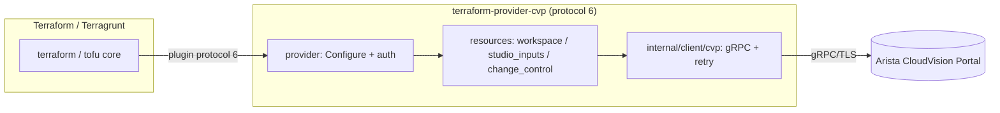

# Architecture

This page is the map. The rationale and resource shapes live in the root
[`design.md`](../design.md); the decisions that shaped them are recorded as
[ADRs](adr/).

## Layers

| Layer | Path | Responsibility |
|---|---|---|
| Entrypoint | [`main.go`](../main.go) | `providerserver.Serve`; `-debug` for `dev_overrides`. |
| Provider | `internal/provider` | Provider schema, `Configure`, auth/TLS, client factory (`ClientBundle`). |
| Resources | `internal/resources/<area>` | One package per resource family; CRUD + Import + plan/validate. |
| CVP client | `internal/client/cvp` | Hand-written gRPC/TLS wrapper; per-service helpers; retry/backoff. |
| Generated stubs | `internal/pb` | buf-generated gRPC message/client stubs from `api/proto` (ADR 0005). |

## Transport

The provider is a gRPC/TLS client of CloudVision Portal Resource APIs. Auth is
one of three methods (`design.md` D4): `cert` (client mTLS), `session` (cookie),
`bearer` (rotatable API token — recommended for CI/CD). Minimum TLS 1.3.

## Resource coverage

Current (v0.1 skeleton, CRUD stubbed): `cvp_workspace`, `cvp_studio_inputs`,
`cvp_change_control`. Planned tiers (configlets, tags, AAA, licensing) are listed
in [`../README.md`](../README.md) and `design.md`. The dependency root is
`cvp_workspace`; one workspace = one apply = one Terragrunt unit
(`design.md` D2, [`standards/terragrunt-integration.md`](standards/terragrunt-integration.md)).

## Key design decisions

Summarised in `design.md` (D1–D8): studio-inputs path-overlap detection at plan
time, workspace-scoped apply, change-control status as a computed attribute,
three native auth methods, immutable `from_package` studios, secret handling,
retry policy, and the prototype→production gates. Cross-cutting architectural
choices are captured as [ADRs](adr/).
