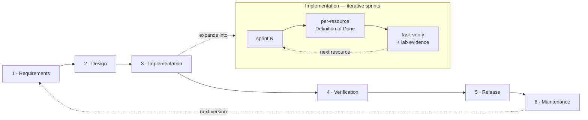

# Development methodology

This is the delivery method for `terraform-provider-cvp`, chosen and owned by
the PM/architect/developer roles jointly. It is deliberately consistent with the
sibling repositories (`pulumi-eos`, `arista-cvp-re`) so a contributor moving
between them meets the same process.

## The choice: gated-iterative delivery

**Phase-gated (Waterfall) macro-lifecycle + iterative sprints inside
implementation + Trunk-Based Development + per-resource Definition of Done +
evidence discipline.**

### Why this and not pure Agile or pure Waterfall

- A Terraform provider has a **hard external contract** (schema, state, registry
  publishing, SemVer). That rewards up-front **design gates** — you cannot
  "refactor away" a shipped breaking schema cheaply. → Waterfall macro-phases.
- But resource coverage is **large and independently deliverable** (dozens of
  `cvp_*` resources), and each needs live-lab feedback. That rewards **short
  iterations** with a crisp per-item done-definition. → Sprints + DoD.
- The target behaviour (CVP gRPC semantics) is **partially reverse-engineered**
  and must not be guessed. → **Evidence discipline** borrowed from
  `arista-cvp-re`.

Pure Agile under-serves the contract stability; pure Waterfall under-serves the
per-resource discovery loop. The hybrid is the fit.

## Roles (one person may wear several hats)

| Role | Owns |
|---|---|
| **PM** | Scope, sprint goals, the phase gates, `CHANGELOG`/release cadence, risk register. |
| **Architect** | Provider/schema/state contract, ADRs, transport & retry design, non-goals. |
| **Developer** | Resource implementation, tests, docs, quality gates green. |

## Delivery lifecycle

Each arrow between macro-phases is a **signed gate**; a downstream phase does not
start until the upstream gate passes.

## Macro-phases (gated)

| Phase | Output | Exit gate |
|---|---|---|
| 1. Requirements | Resource catalog, scope, non-goals, KPIs. | Catalog + non-goals frozen for the version. |
| 2. Design | Schema draft, `Args`/`State` shapes, transport matrix, error taxonomy, ADRs. | `terraform-registry-manifest.json` valid; ADRs frozen; public surface frozen for the minor. |
| 3. Implementation | Resources by dependency depth, each meeting the DoD. | All in-scope resources pass unit + lab acceptance. |
| 4. Verification | Version matrix (CVP releases), soak, negative tests. | Matrix green; P95 latency budget met. |
| 5. Release | Signed release + registry submission + docs. | `pulumi plugin`-equivalent install works; registry listing live. |
| 6. Maintenance | Patch/minor cadence; weekly dep + CVE SLA. | Ongoing. |

A downstream phase does not start until the upstream gate is signed off in the
sprint log.

## Iteration mechanics

- **Sprints** are 2 weeks. Sprint work lands on a `sprint/<id>-<scope>` branch;
  the sprint PR body cites the exit criteria it satisfies.
- **Trunk-Based Development:** `main` is always shippable; short-lived branches,
  squash-merge, no long-running divergent forks.
- **Per-resource Definition of Done** is the unit of progress — see
  [`standards/terraform-provider-best-practices.md`](standards/terraform-provider-best-practices.md)
  § "Definition of done".
- **Quality gates** (`task all` / `task verify`) are the automated part of the
  gate; a resource is not "done" until they are green with lab evidence quoted
  in the commit/PR.

## Evidence discipline

Every factual claim about Arista CVP/EOS behaviour that a resource relies on
carries a source. Facts are corroborated through the local `arista-mcp` MCP and,
where possible, a live round-trip against the netlab2 CVP lab; the corroboration
is cited in the resource's package comment or the commit body. Unverified
assumptions are labelled and kept non-load-bearing. This is what keeps a
reverse-engineered target from drifting into guesswork.

## Backlog

Capabilities and ideas beyond the committed roadmap live in
[`backlog.md`](backlog.md) — modern Terraform / Terragrunt / enterprise features
mapped to CVP, prioritized P0/P1/P2. A backlog item graduates to an ADR + a
sprint once it clears the Definition of Ready below.

## Definition of ready (before a resource enters a sprint)

- CVP service + RPC identified and reachable in the lab.
- Schema shape drafted and reviewed against the API (principle 3).
- Auth path and required permissions known.
- Test approach sketched (what the acceptance test will assert).

## Cadence & tracking

- Risk register and sprint goals live in `docs/` (added as the project moves
  past skeleton).
- ADRs are immutable, numbered records under [`adr/`](adr/).
- Release cadence per [`release.md`](release.md).
