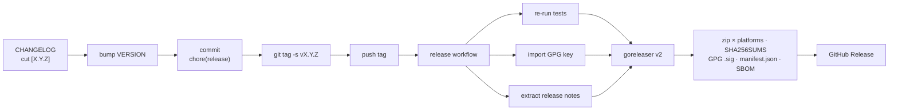

# Release

## Cadence

| Type | Trigger |
|---|---|
| Patch (`vX.Y.Z+1`) | Backward-compatible bug fix on `main`. |
| Minor (`vX.Y+1.0`) | New backward-compatible features (also breaking changes while `0.x`). |
| Major (`vX+1.0.0`) | Breaking change, after `1.0.0`. |

Per [`standards/versioning.md`](standards/versioning.md).

## Process

1. Move `CHANGELOG.md` `[Unreleased]` into a dated `## [X.Y.Z] — YYYY-MM-DD`
   section; recreate an empty `[Unreleased]`.
2. Update [`VERSION`](../VERSION).
3. Commit `chore(release): X.Y.Z`.
4. Tag: `git tag -s vX.Y.Z -m "release: vX.Y.Z"` (annotated, GPG-signed).
5. Push the tag → the [`release`](../.github/workflows/release.yml) workflow
   fires:
   - re-runs the test suite,
   - imports the GPG signing key,
   - `awk`-extracts the release notes for this version from `CHANGELOG.md`,
   - runs **goreleaser v2** to build, archive, checksum, GPG-sign, and SBOM.

## Artefacts per release (Terraform Registry contract)

goreleaser (`.goreleaser.yml`) produces exactly what the
[Registry publishing flow](https://developer.hashicorp.com/terraform/registry/providers/publishing)
requires:

| Artefact | Notes |
|---|---|
| `terraform-provider-cvp_<version>_<os>_<arch>.zip` | linux/darwin/windows/freebsd × amd64/arm64 (+ arm/386 where valid). |
| `terraform-provider-cvp_<version>_SHA256SUMS` | checksums. |
| `terraform-provider-cvp_<version>_SHA256SUMS.sig` | **GPG** detached signature (Registry mandates GPG, not cosign). |
| `terraform-provider-cvp_<version>_manifest.json` | protocol-version manifest. |
| `*.spdx.json` | SPDX SBOM per archive (supply-chain provenance). |

## Signing key

The release job needs three repository secrets:

- `GPG_PRIVATE_KEY` — ASCII-armored private key,
- `PASSPHRASE` — its passphrase,
- and the public key registered with the Terraform Registry namespace.

The signing key material is stored in `gopass`, never in the repo.

## Terraform Registry submission (for `1.0.0`)

- [ ] Apache-2.0 `LICENSE` (present).
- [ ] Valid top-level `terraform-registry-manifest.json` (protocol 6.0, present).
- [ ] At least one stable `vX.Y.Z` release with the GPG-signed bundle.
- [ ] GPG public key added to the registry namespace.
- [ ] Reference docs generated by `tfplugindocs` under `docs/`.
- [ ] ≥ 3 example programs (`examples/`).

## Pre-releases

`vX.Y.Z-rc.N` tags trigger the same workflow with `prerelease: auto`; they are
validated against the netlab2 lab and never promoted to a stable Registry
version.
